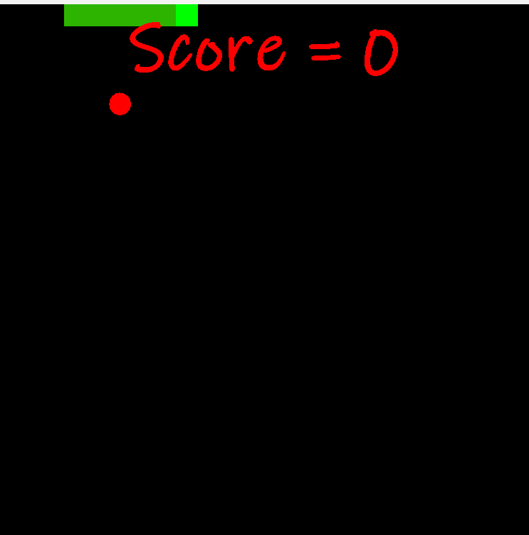

# 🐍 Snake Game 
A simple **Snake Game** built in **Java** using **Swing** for GUI rendering.  
The game includes smooth controls, apple generation, score tracking, and game-over handling.

---

## 🚀 Features
* 🎮 Classic Snake gameplay  
* 🍎 Random apple generation  
* 🧮 Score tracking  
* 💀 Game Over screen  
* ⌨️ Keyboard controls (Arrow keys to move)  
* 🖥️ Built using **Java Swing**

## 🎮 Controls
* ⬆️ Up Arrow → Move Up
* ⬇️ Down Arrow → Move Down
* ⬅️ Left Arrow → Move Left
* ➡️ Right Arrow → Move Right

## 📸 Screenshots

